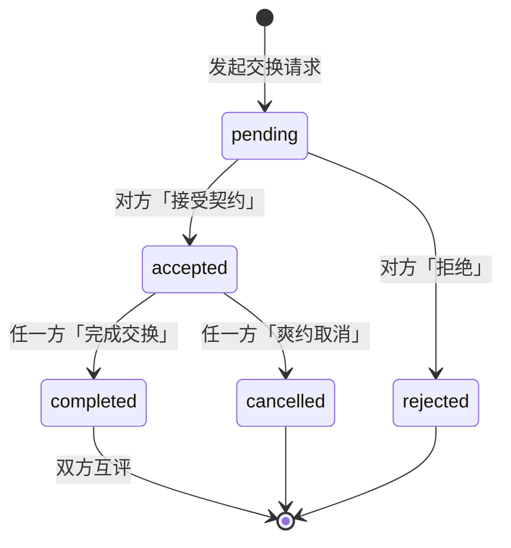

# 技换 SkillSwap · 产品需求文档（PRD）

> 用你的技能，换一个新世界 ⇄

---

## 1. 文档信息

| 项目 | 内容 |
| --- | --- |
| 产品名称 | 技换 SkillSwap |
| 文档版本 | V1.0 |
| 文档状态 | 已发布 |
| 撰写日期 | 2026-09-19 |
| 作者 | 产品团队 |
| 对应 Demo 版本 | 纯前端单页应用（原生 HTML/CSS/JS） |

**修订记录**

| 版本 | 日期 | 修订内容 | 作者 |
| --- | --- | --- | --- |
| V1.0 | 2026-09-19 | 首版，对照当前 demo 已实现功能撰写 | 产品团队 |

> 说明：本文档严格对照当前可运行 demo 的已实现功能撰写。所有未在 demo 中实现的能力统一归入第 9 章「后续规划」，不在功能需求章节中虚构。

---

## 2. 产品概述

### 2.1 背景与问题

- 想系统性学习一项技能，报班费用高、时间成本大；自学又缺乏反馈与坚持的动力。
- 与此同时，每个人身上都有「别人没有的东西」——编程、乐器、语言、摄影等可教授的技能。
- 技能拥有者与技能学习者之间缺少一个低门槛、强信任的双向撮合渠道。

### 2.2 产品定位

「技换 SkillSwap」是一个**技能互换社区平台**：用户同时发布「我能教的」与「我想学的」两类技能信息，平台通过**双向智能匹配算法**撮合交换伙伴，并以**交换契约、信用分、徽章与互评机制**保障交换质量、降低爽约率。

- **Slogan**：用你的技能，换一个新世界
- **当前形态**：纯前端单页应用（SPA），无需注册、开箱即体验，内置种子数据（8 名用户、21 条技能、2 条交换请求、3 条评价）
- **核心特征**：不用钱，用技能换技能

### 2.3 目标用户

| 用户分层 | 特征 | 典型诉求 |
| --- | --- | --- |
| 学生 / 职场新人 | 预算有限，学习意愿强 | 低成本习得编程、语言、设计等实用技能 |
| 斜杠青年 / 兴趣爱好者 | 身怀一技之长，兴趣广泛 | 用自己的特长换取新技能，拓展兴趣边界 |
| 自由职业者 / 从业者 | 有变现或引流诉求 | 通过「付费请教」开关获得额外收益渠道 |

### 2.4 核心价值

1. **双向价值交换**：教与学同时发生，一次交换双方都获益，而非单向付费课程。
2. **算法撮合效率**：双向匹配算法优先呈现「你教的 = TA 想学的」完美搭档，降低搜寻成本。
3. **信任与履约保障**：轻量契约 + 信用分 + 徽章 + 互评，形成正向循环的社区秩序。
4. **零门槛体验**：无需注册，打开即用，30 秒完成技能上架。

---

## 3. 产品信息架构

### 3.1 页面结构

```
技换 SkillSwap（单页应用）
├── 首页 Home                #/home
├── 技能广场 Skill Plaza      #/plaza
├── 发布技能 Publish          #/publish
├── 智能匹配 Match            #/match
└── 我的 Me                  #/me
        ├── 资料卡与徽章墙
        ├── 我发布的技能
        ├── 交换请求（我收到的 / 我发起的）
        └── 收到的评价
```

### 3.2 Hash 路由表

| 路由 | 页面 | 说明 |
| --- | --- | --- |
| `#/home` | 首页 | 默认路由；非法 hash 回退至首页 |
| `#/plaza` | 技能广场 | teach 类技能卡片流，支持搜索与分类筛选 |
| `#/publish` | 发布技能 | 「我能教 + 我想学」双栏表单 |
| `#/match` | 智能匹配 | 匹配结果列表，无技能时展示空态引导 |
| `#/me` | 我的 | 个人资料、技能管理、交换请求、评价 |

路由机制：监听 `hashchange` 事件切换视图容器显隐（`.view` 的 `hidden` 属性），切换后页面滚动至顶部，并同步高亮桌面端与移动端导航项（含滑动墨水条动画）。

### 3.3 导航机制

- **桌面端（>768px）**：顶部玻璃拟态（glassmorphism）导航栏，含 Logo、5 个页面 Tab、滑动墨水条指示器；「我的」Tab 携带待处理请求数字角标。
- **移动端（≤768px）**：底部固定 Tab 栏，中央为凸起「发布」FAB 按钮；「我的」Tab 携带红点角标。
- **角标规则**：当「我收到的」交换请求中存在 `pending` 状态记录时，桌面端显示数量角标、移动端显示红点；数量为 0 时隐藏。

---

## 4. 功能需求详述

### 4.1 首页

| 编号 | 功能点 | 功能描述 |
| --- | --- | --- |
| F-HOME-01 | Hero 区 | 展示 slogan「用你的技能，换一个新世界」、产品副文案与渐变背景装饰（hero blob）；提供双 CTA：「发布我的技能」（跳转 `#/publish`）、「逛逛技能广场」（跳转 `#/plaza`） |
| F-HOME-02 | 三步流程说明 | 以 01/02/03 步骤卡展示核心流程：发布技能 → 智能匹配 → 达成交换 |
| F-HOME-03 | 热门分类标签云 | 展示 8 大分类标签（编程/乐器/语言/设计/摄影/生活/运动/职场），每个标签使用分类专属渐变配色；点击后跳转技能广场并自动选中该分类 |
| F-HOME-04 | 精选技能卡片 | 展示 teach 类技能列表前 6 张卡片，卡片结构与技能广场一致（见 4.2） |
| F-HOME-05 | 平台数据看板 | 4 项指标：在册技能数（实时统计）、注册用户（种子用户数 + 1286 展示基数）、成功交换（356 起步，随完成交换实时累加）、好评率 98%（固定展示值）；数字带滚动动画（约 1.4s 缓出，≥100 的数字结尾追加「+」） |

**用户故事**：作为新访客，我希望进入首页后 10 秒内理解「这个平台能帮我干什么、怎么用」，并有一键开始的入口。

**业务规则**

- 数据看板数字均为演示数据口径，随本地数据变化（技能数、成功交换数为真实实时值）。
- 点击分类标签跳转广场时会清空广场关键词，仅保留分类筛选。

**异常与边界态**：无 teach 技能时精选区为空网格；动画在 `prefers-reduced-motion` 下按样式降级。

### 4.2 技能广场

| 编号 | 功能点 | 功能描述 |
| --- | --- | --- |
| F-PLAZA-01 | 技能卡片流 | 仅展示 `type=teach` 的技能卡片，按发布时间倒序（新发布在前）；卡片包含：分类标签（专属色）、授课形式标签（线上/线下/均可）、技能名称、熟练程度（4 级圆点：入门/熟练/精通/大神）、一句话简介、教学者头像/昵称/徽章/信用分、期望交换内容、「发起交换」按钮 |
| F-PLAZA-02 | 关键词搜索 | 输入框支持按技能名称、技能描述、教学者昵称模糊匹配（大小写不敏感）；输入防抖 250ms 后自动刷新列表并保持输入框焦点 |
| F-PLAZA-03 | 分类筛选 | 「全部 + 8 大分类」筛选 chips，单选；与关键词搜索条件叠加生效 |
| F-PLAZA-04 | 发起交换 | 点击卡片「发起交换」打开交换契约模态框（见 4.6）；若当前用户尚未发布 teach 技能，则 Toast 提示并引导跳转发布页 |
| F-PLAZA-05 | 空态引导 | 筛选/搜索无结果时展示空态插画文案，并提供「自己发布一个」链接跳转发布页 |

**用户故事**：作为学习者，我希望能按分类浏览或搜索想学的技能，并快速判断教学者的可信度（徽章、信用分）。

**业务规则**

- 卡片上「想换」字段为空时兜底展示「任意技能，聊得来就行」；开启付费请教的技能追加「💰 也可付费请教」标识。
- 自己发布的技能卡片不显示「发起交换」按钮，改显示「我发布的」标识，防止自交换。

**异常与边界态**：搜索与分类叠加无结果 → 空态；长文本通过 `maxlength` 在录入侧截断。

### 4.3 发布技能

| 编号 | 功能点 | 功能描述 |
| --- | --- | --- |
| F-PUB-01 | 双栏表单 | 左栏「🍊 我能教的」、右栏「🍇 我想学的」，一次提交同时生成 teach、learn 两条技能记录 |
| F-PUB-02 | 表单字段 | 我能教：技能名称*（≤20 字）、分类*（8 选 1）、熟练程度（滑块 0-3 级，实时显示等级文案，默认「精通」）、授课形式（线上/线下/均可）、一句话简介（≤120 字）、付费请教开关；我想学：技能名称*（≤20 字）、分类*、期望达到程度（滑块，默认「熟练」）、学习形式、学习目标（≤120 字）、想用来交换的技能（≤20 字） |
| F-PUB-03 | 校验与提示 | 技能名称与分类为必填；提交时未填字段标红（invalid 态）并 Toast「请完善必填项」；使用 `novalidate` 自定义校验 |
| F-PUB-04 | 提交反馈 | 提交成功后触发 confetti 彩带庆祝（100 片）、Toast「发布成功！正在为你寻找匹配…」，约 900ms 后自动跳转智能匹配页 |

**用户故事**：作为技能拥有者，我希望用 30 秒同时登记「我能教」和「我想学」，并立刻看到系统为我找到的匹配对象。

**业务规则**

- teach 记录的「想换」字段默认取 learn 的技能名称；learn 记录的「想换」字段默认回退为 teach 技能名称，保证双向信息闭环。
- teach 简介为空时兜底文案「这位同学很酷，什么都没写。」。

**异常与边界态**：必填缺失 → 阻断提交并标红；超长输入由 `maxlength` 限制。

### 4.4 智能匹配

| 编号 | 功能点 | 功能描述 |
| --- | --- | --- |
| F-MATCH-01 | 匹配结果列表 | 基于匹配引擎（见 5.1）计算当前用户与全量其他用户的匹配度，按分数降序展示（分数相同按对方信用分降序） |
| F-MATCH-02 | 匹配度环形图 | SVG 环形进度动画展示匹配分数；完美匹配使用金色渐变描边，普通匹配使用品牌紫橙渐变 |
| F-MATCH-03 | 交换示意图 | 卡片中部以「我教 · X ⇄ TA 教 · Y」直观展示交换内容 |
| F-MATCH-04 | 匹配标签 | 展示匹配类型（✨ 完美双向匹配 / 单向匹配）、对方付费请教标识、授课形式 |
| F-MATCH-05 | 发起交换 | 点击「发起交换」打开契约模态框；若与对方的请求已处于 pending 或 accepted 状态，按钮置灰显示「已发起交换」，防止重复发起 |
| F-MATCH-06 | 查看主页 | 点击「查看 TA 的主页」打开用户主页模态框（见 4.8） |
| F-MATCH-07 | 空态 | 未发布任何技能时展示引导空态（「去发布我的技能」CTA）；已发布但无匹配结果时展示「再发布一个技能」空态 |

**用户故事**：作为已发布技能的用户，我希望系统按「匹配度从高到低」告诉我谁最适合和我交换，并说明为什么匹配。

**业务规则**：完美匹配（双向命中）卡片置顶且金色描边；匹配分数含信用加权（见 5.1）。

### 4.5 我的

| 编号 | 功能点 | 功能描述 |
| --- | --- | --- |
| F-ME-01 | 资料卡 | 展示头像、昵称、居民编号（演示文案「技换第 1024 位居民」）、当前信用分、至下一徽章的进度条与差额提示；已达最高徽章时展示「已达最高徽章等级 🎉」 |
| F-ME-02 | 徽章墙 | 展示 3 枚徽章（见 5.3），已解锁高亮、未解锁置灰（locked 态），悬浮显示解锁条件 |
| F-ME-03 | 我发布的技能 | 列表展示我发布的全部技能（teach 显示分类色标签 + 等级圆点，learn 显示灰色「想学」标签）；支持删除，删除后 Toast 确认 |
| F-ME-04 | 交换请求 | 双 Tab：「我收到的」「我发起的」（Tab 标题含数量统计），按发起时间倒序；每条请求展示对方昵称、状态标签、契约摘要（交换内容、形式、周期、留言）及状态对应的操作按钮（见 5.2 状态机） |
| F-ME-05 | 收到的评价 | 列表展示我收到的评价：星级（★/☆）、评语、评价人与日期；空态引导「完成一次交换后，就能收到来自伙伴的评价啦」 |

**用户故事**：作为平台用户，我希望在一个页面看清自己的信用资产、技能资产、进行中的交换和口碑积累。

**业务规则**：删除技能立即生效并写入本地存储，无二次确认弹窗（demo 口径）。

### 4.6 交换契约模态框

| 编号 | 功能点 | 功能描述 |
| --- | --- | --- |
| F-CT-01 | 契约内容确认 | 顶部展示「我教 · X ⇄ TA 教 · Y」交换示意图 |
| F-CT-02 | 契约条款 | 交换形式（线上·视频/语音、线下·咖啡馆/自习室、线上+线下混合）、交换周期（1 周速成 / 2 周 / 1 个月（默认）/ 长期互助）、给对方捎句话（≤100 字） |
| F-CT-03 | 爽约提示 | 提交按钮下方常驻提示「契约达成后爽约将扣除 15 信用分」 |
| F-CT-04 | 提交反馈 | 提交后生成 pending 状态请求、confetti（60 片）、Toast「已向 XX 发送交换请求」，并刷新角标与匹配页按钮置灰状态 |

**业务规则**：同一对用户间已存在 pending/accepted 请求时入口按钮置灰（见 F-MATCH-05），从源头防止重复契约。

### 4.7 互评模态框

| 编号 | 功能点 | 功能描述 |
| --- | --- | --- |
| F-RV-01 | 星级评价 | 1-5 星点选（默认 5 星），点击实时高亮 |
| F-RV-02 | 评语 | 文本框 ≤120 字；为空时兜底文案「一次愉快的技能交换！」 |
| F-RV-03 | 信用联动 | 评分 ≥4 星时，对方信用分 +5；提交后 confetti + Toast，并刷新「我的」页面 |

**触发时机**：完成交换后 600ms 自动弹出；已完成且我尚未评价的请求，在「我的-交换请求」中展示「评价 TA」入口。同一请求我评价过一次后入口隐藏（防止重复评价）。

### 4.8 用户主页模态框

| 编号 | 功能点 | 功能描述 |
| --- | --- | --- |
| F-UP-01 | 用户概览 | 头像、昵称、最高徽章、信用分、累计完成交换次数 |
| F-UP-02 | TA 能教的 | 该用户全部 teach 技能（分类、名称、等级、授课形式） |
| F-UP-03 | 收到的评价 | 最近 3 条评价（星级、评语、评价人）；无评价时展示「还没有收到评价」 |

### 4.9 全局机制

| 编号 | 功能点 | 功能描述 |
| --- | --- | --- |
| F-GL-01 | Toast 通知 | 页面顶部浮层提示，支持 success / error 类型，约 2.4s 自动淡出移除 |
| F-GL-02 | Confetti 彩带 | 关键正向事件（发布成功、发送请求、契约达成、完成交换、评价成功）触发 6 色彩带动画，片数随场景 50-100 |
| F-GL-03 | 信用变动提醒 | 当前用户信用分变动时 Toast 展示增减分值与原因（如「+10 信用分 · 完成交换」） |
| F-GL-04 | 导航角标 | 待处理（pending）的收到请求数实时同步至桌面/移动端导航角标 |
| F-GL-05 | 模态框体系 | 统一遮罩 + 卡片式模态框（契约/互评/用户主页），点击遮罩或 ✕ 关闭 |

---

## 5. 核心机制

### 5.1 双向匹配算法

**匹配判定**（标题匹配规则：忽略大小写与首尾空格后，相等或互为子串即命中）：

| 匹配层级 | 判定条件 | 基础分 |
| --- | --- | --- |
| 完美匹配 | 存在「我教的 ∈ TA 想学的」**且**「我想学的 ∈ TA 能教的」 | 100 |
| 单向匹配 | 双向中仅命中一侧 | 60 |
| 同分类兜底 | 标题未命中，但存在同分类的教/学关系 | 45 |

**加分与排序规则**：

1. 非完美匹配下双向均为同分类弱匹配：`+15`；单侧同分类加成：`+10`
2. 信用加权：`+ round(对方信用分 / 50)`，总分封顶 100
3. 排序：匹配分降序 → 对方信用分降序
4. 完美匹配标识：双向精确命中，或双向弱匹配且加权后分数 ≥ 90（金色描边置顶）

### 5.2 交换请求状态机



**状态流转规则**：

| 当前状态 | 可操作方 | 操作 | 流转结果 | 副作用 |
| --- | --- | --- | --- | --- |
| pending | 接收方 | 接受契约 | accepted | confetti + Toast「契约达成」 |
| pending | 接收方 | 拒绝 | rejected | Toast「已拒绝该请求」 |
| accepted | 双方任一方 | 完成交换 | completed | 双方各 +10 信用分、平台成功交换数 +1、600ms 后自动弹出互评 |
| accepted | 双方任一方 | 爽约取消 | cancelled | 操作方 -15 信用分、Toast 警示 |
| completed | 双方 | 评价 TA | （状态不变） | 生成评价记录；≥4 星对方 +5 信用分；已评价后入口隐藏 |

**状态文案**：pending=待处理、accepted=进行中、rejected=已拒绝、completed=已完成、cancelled=已爽约。

### 5.3 信用分与徽章体系

**信用分规则**（`CREDIT_RULES`，下限 0 分）：

| 事件 | 分值变动 |
| --- | --- |
| 完成一次交换（双方） | +10 |
| 收到 ≥4 星好评（被评价方） | +5 |
| 契约达成后爽约（操作方） | -15 |

**徽章体系**（按信用分自动授予，取已达成的最高档作为对外展示徽章）：

| 徽章 | 解锁门槛 | 图标 | 说明 |
| --- | --- | --- | --- |
| 新手村 | 信用分 ≥ 0 | 🌱 | 加入技换大家庭 |
| 靠谱交换者 | 信用分 ≥ 50 | 🤝 | 信用分达 50 |
| 技能达人 | 信用分 ≥ 100 | 🏆 | 信用分达 100 |

徽章对外展示场景：技能卡片、匹配卡片、用户主页、「我的」徽章墙（未解锁置灰）。

---

## 6. 数据需求

### 6.1 数据实体

**users（用户）**

| 字段 | 类型 | 说明 |
| --- | --- | --- |
| id | string | 用户 ID；当前用户固定为 `me` |
| name | string | 昵称 |
| avatar | string | Emoji 头像 |
| credit | number | 信用分（下限 0） |

**skills（技能）**

| 字段 | 类型 | 说明 |
| --- | --- | --- |
| id | string | 技能 ID（时间戳 + 随机串） |
| userId | string | 所属用户 ID |
| type | enum | `teach`（我能教）/ `learn`（我想学） |
| title | string | 技能名称（≤20 字） |
| category | enum | 8 大分类之一 |
| level | number | 0-3，对应 入门/熟练/精通/大神 |
| mode | enum | 线上 / 线下 / 均可 |
| desc | string | 简介（≤120 字） |
| want | string | 期望交换的技能 |
| paid | boolean | 是否接受付费请教（仅 teach 有意义） |
| createdAt | number | 发布时间戳 |

**requests（交换请求）**

| 字段 | 类型 | 说明 |
| --- | --- | --- |
| id | string | 请求 ID |
| from / to | string | 发起方 / 接收方用户 ID |
| fromSkill / toSkill | string | 双方交换的技能名称快照 |
| form | string | 交换形式 |
| period | string | 交换周期 |
| note | string | 留言（≤100 字） |
| status | enum | pending / accepted / rejected / completed / cancelled |
| createdAt / updatedAt | number | 创建 / 更新时间戳 |

**reviews（评价）**

| 字段 | 类型 | 说明 |
| --- | --- | --- |
| id | string | 评价 ID |
| from / to | string | 评价方 / 被评价方用户 ID |
| stars | number | 1-5 星 |
| text | string | 评语（≤120 字） |
| reqId | string | 关联的交换请求 ID（用于防重复评价） |
| createdAt | number | 评价时间戳 |

### 6.2 存储方案

- 采用浏览器 `localStorage` 持久化，存储键：`skillswap_v1`，整体 JSON 序列化。
- 首次访问或数据损坏时自动回退至种子数据并写回。
- 种子数据：8 名用户、21 条技能、2 条交换请求（1 条 pending、1 条 accepted）、3 条评价、平台成功交换基数 356。
- 顶层另含 `exchangesDone`（平台成功交换累计）与 `seededAt`（种子写入时间）。

---

## 7. 非功能需求

| 类别 | 需求描述 |
| --- | --- |
| 性能 | 搜索输入 250ms 防抖，避免高频重渲染；动画基于 `requestAnimationFrame`；confetti 元素 3.6s 后自动移除，避免 DOM 堆积 |
| 响应式 | 断点 1024px（卡片网格与双栏表单降级）与 768px（切换为移动端底部 Tab 导航、隐藏顶部导航） |
| 可访问性 | 尊重 `prefers-reduced-motion: reduce`，动画整体降级；导航含 `aria-label`，Toast 容器 `aria-live="polite"` |
| 安全 | 所有用户输入经 HTML 转义后渲染（防 XSS）；表单录入侧 `maxlength` 截断 |
| 浏览器兼容 | 支持现代浏览器（Chrome / Edge / Firefox / Safari 最新两个大版本），依赖 `localStorage`、`hashchange`、`requestAnimationFrame` 等标准 Web API |
| 数据可靠性 | localStorage 读写 try-catch 兜底，写入失败仅控制台告警、不阻断交互 |

---

## 8. 衡量指标

| 指标 | 定义 | 目标（建议） |
| --- | --- | --- |
| 技能发布率 | 进入发布页的用户中完成发布的比例 | ≥ 40% |
| 匹配发起率 | 查看匹配结果的用户中发起交换请求的比例 | ≥ 25% |
| 交换完成率 | accepted 请求中最终 completed 的比例 | ≥ 60% |
| 互评率 | completed 交换中双方均完成评价的比例 | ≥ 50% |
| 爽约率 | accepted 请求中 cancelled 的比例 | ≤ 10% |

> 当前 demo 为纯前端演示，尚无埋点与数据采集能力，以上为上线后的建议口径与目标值。

---

## 9. 后续规划

以下为当前 demo **未实现**的能力，按优先级规划：

| 优先级 | 方向 | 说明 |
| --- | --- | --- |
| P0 | 账号体系 | 注册/登录、真实用户身份、多端数据同步 |
| P0 | 服务端持久化 | 替代 localStorage，支持跨设备与社区真实数据 |
| P1 | IM 即时沟通 | 契约达成前后的站内私信，降低沟通成本与爽约率 |
| P1 | 搜索与推荐升级 | 分词搜索、模糊匹配增强、基于行为的个性化推荐 |
| P1 | 付费请教闭环 | 支付与结算能力，打通「可付费请教」的商业化路径 |
| P2 | 信用分精细化 | 更多信用事件（如响应速度、履约准时度）、信用分明细页 |
| P2 | 内容治理 | 技能信息审核、举报与申诉机制 |
| P3 | 小程序 / App 端 | 覆盖移动端原生场景 |
